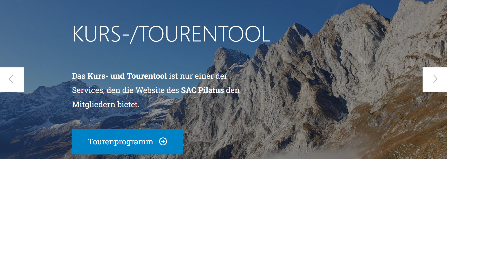

# Contao Bootstrap Carousel Bundle
This bundle provides a [Bootstrap Carousel](https://getbootstrap.com/docs/5.2/components/carousel/) content element for the [Contao CMS](https://contao.org/).

## Requirements

- Contao 5.3 or later, including Contao 6

## Installation

```bash
composer require markocupic/bootstrap-carousel-bundle
```

To make the plugin work, you have to embed [Bootstrap](https://getbootstrap.com/docs/5.2/getting-started/download/#cdn-via-jsdelivr) to your Contao layout. 



## Custom templates

The templates of the content elements are located in `contao/templates/content_element/`:

- `content_element/bootstrap_carousel_start.html.twig`
- `content_element/bootstrap_carousel_separator.html.twig`
- `content_element/bootstrap_carousel_stop.html.twig`

To override one of them, create a template variant, e.g. `templates/content_element/bootstrap_carousel_start/my_carousel.html.twig`, and select it in the content element. A variant can extend the original template and override single blocks:

```twig



```

The available variables are documented at the top of each template. The blocks are `indicators` and `progress` (start element) and `controls`, `style` and `script` (stop element).

### Upgrading to version 3

The templates have been moved to the modern Contao template system and the template variables have been renamed (e.g. `identifier` is now `carousel_id`). Custom templates based on `ce_bootstrapCarouselStart`, `ce_bootstrapCarouselSeparator` or `ce_bootstrapCarouselStop` no longer work. Recreate them as variants of the new templates and select the new variants in the content elements.
